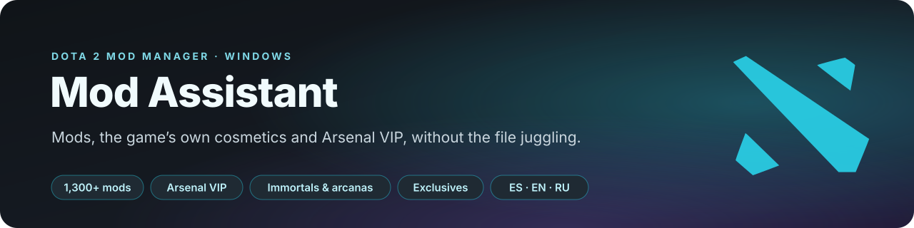
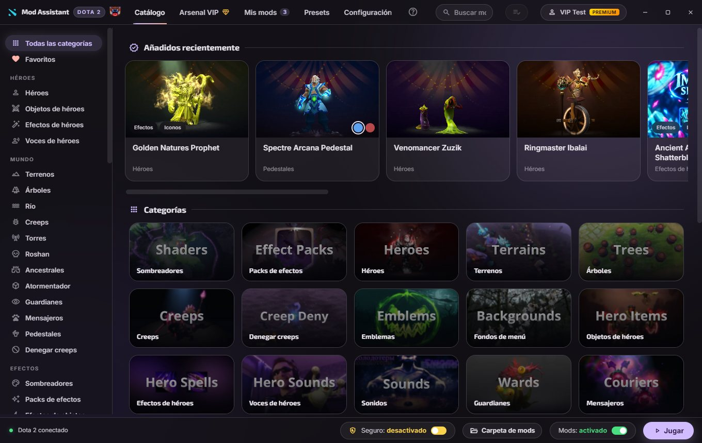
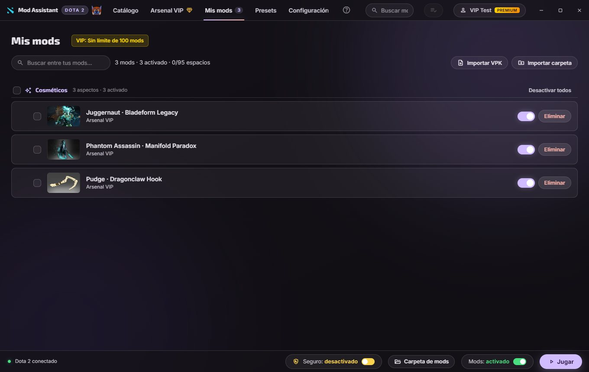

<div align="center">



<p>
  <a href="README.md"></a>
  
  <a href="README.ru.md"></a>
</p>

<p>
  <a href="https://github.com/Dreftian/Dota2-Mods-Releases/releases/latest/download/Dota2-Mod-Setup.exe">
    </a>
  
  
</p>

<p>
  <a href="LICENSE"></a>
  <a href="https://dota2-mods.vercel.app"></a>
  
</p>

<p>
  <b>
  <a href="#what-it-does">What it does</a> &nbsp;·&nbsp;
  <a href="#arsenal-vip">Arsenal VIP</a> &nbsp;·&nbsp;
  <a href="#install">Install</a> &nbsp;·&nbsp;
  <a href="#how-it-works">How it works</a> &nbsp;·&nbsp;
  <a href="#new-in-110">What's new</a> &nbsp;·&nbsp;
  <a href="#development">Development</a> &nbsp;·&nbsp;
  <a href="#license-and-credits">License</a>
  </b>
</p>


</div>

> [!NOTE]
> Mod Assistant is not affiliated with Valve. Everything it installs is client-side: only you see
> it, and no other player's game is touched. Safe mode is on by default and keeps the app out of
> Dota's own files; the one feature that changes them asks first and reverts byte for byte.

> **Why not just copy the files yourself?** You can. What the app adds is everything after that:
> switching a mod off before a match without deleting it, wearing an immortal or a courier your
> account never had, sending your setup as one link, and a game that still works after a Dota patch.

<br>

## What it does

<table>
<tr><td width="230"><b>The whole catalog</b></td><td>1,300+ community mods in 41 categories (heroes, effects, terrains, trees, river, creeps, towers, Roshan, wards, couriers, HUDs, emblems, icons, cursors, fonts, announcers, music and sounds), read live from the <a href="https://github.com/h6rd/Dota2PornFxWeb">D2PFX</a> repository: a mod published today installs today</td></tr>
<tr><td><b>Arsenal VIP</b></td><td>Any immortal, arcana or cosmetic of any hero, slot by slot, with styles, variants and whole sets, including the <b>exclusives the store never sold</b>. <a href="#arsenal-vip">Below</a></td></tr>
<tr><td><b>The game's own cosmetics, free</b></td><td>Weather, terrain, HUD, 2,000+ loading screens, 200+ couriers, wards, creeps, towers, music, announcers, mega-kills, kill streaks, cursor packs and Roshan skins, read from your own game's item table, so whatever Valve adds appears by itself</td></tr>
<tr><td><b>One click in, one click out</b></td><td>The app downloads the mod, picks a free pak slot and cleans up after itself. Categories that must load early get low slots by themselves</td></tr>
<tr><td><b>Switch off, don't delete</b></td><td>Turn a mod off before a match and back on after. Your library stays, the game folder stays clean</td></tr>
<tr><td><b>It says when mods collide</b></td><td>Two mods carrying the same file cannot both win. The app names the file, says which mod the game loads it from and lets you reorder</td></tr>
<tr><td><b>Rank and hero level</b></td><td>Customize your profile medal (Immortal and Top 10/100/1000 with their number included) with the stars baked in, and the hero level badges</td></tr>
<tr><td><b>Setups by link</b></td><td>Save what you run as a preset and send it in one message or as a <code>.d2mm</code> file. The other side gets the same look</td></tr>
<tr><td><b>It survives Dota patches</b></td><td>The app notices a game update and puts back what the patch wiped, without ever writing while Dota is running</td></tr>
</table>

<details>
<summary><b>And the rest</b></summary>
<br>
<table>
<tr><td width="230"><b>An install list</b></td><td>Put mods aside while you browse and install them all at once</td></tr>
<tr><td><b>Filters and search</b></td><td>Chips for what a mod changes, the item slot, the hero list, and one search across the catalog and the cosmetics</td></tr>
<tr><td><b>Fonts and cursors</b></td><td>Installed into the game files with a backup of the originals; removing them restores vanilla</td></tr>
<tr><td><b>Combined packs</b></td><td>Merge several mods into one pak slot, and take them apart again</td></tr>
<tr><td><b>Your own files</b></td><td>Import a <code>.vpk</code> or a <code>.zip</code>, or adopt what another tool left in the folder. The app identifies it against the catalog</td></tr>
<tr><td><b>Auto-updates</b></td><td>The installed app looks for new versions in <a href="https://github.com/Dreftian/Dota2-Mods-Releases">Dota2-Mods-Releases</a> and updates itself</td></tr>
<tr><td><b>No telemetry</b></td><td>Nothing is collected and nothing is sent. The account is local, on your PC</td></tr>
</table>
</details>

<div align="center">
  
  
</div>

<br>

## Arsenal VIP


The Arsenal rewrites the default items every account owns, in your own game's item table, so they
are drawn as the cosmetic you pick. That is why you do not need it in your inventory, and why only
you see it.

- **Every hero, every slot**: weapon, head, shoulders, back, arms, mount, the whole hero look (the
  arcanas that replace the model), personas, summons, abilities and voice.
- **Every rarity**: arcanas and immortals by default, the rest (legendary, mythical, rare...) one
  click away.
- **Exclusives**: a filter shows what the store never sold, from treasures, battle passes and
  events, such as Dragonclaw Hook, Phantom Advent or Planetfall. In today's item table that is 99%
  of the immortals.
- **Styles and variants**: every style of an arcana can be chosen, and variants (Golden, Crimson,
  Tyrian...) are grouped under their original.
- **Whole sets** in one click, from the game's own bundles.
- **Personas**: picking a persona item switches the persona on by itself.
- Every pick is an ordinary **My mods** record: switch it off, remove it, share it in a preset.

It needs safe mode off (the app explains it and does it for you) and a VIP account.

<br>

## Install

1. Download the **[Mod Assistant installer](https://github.com/Dreftian/Dota2-Mods-Releases/releases/latest/download/Dota2-Mod-Setup.exe)**:
   a direct link, always the latest version. There is also a
   [portable build](https://github.com/Dreftian/Dota2-Mods-Releases/releases/latest/download/Dota2.Mod.exe).
2. Run it. It installs without administrator rights, creates a shortcut and starts.
3. It finds Dota 2 by itself. No launch options, no Steam properties to edit.

> [!IMPORTANT]
> Windows will call the publisher unknown, because the installer carries no paid code signature
> yet. Click **More info**, then **Run anyway**. Every release is published with its complete
> source code in [Dota2-Mods-Releases](https://github.com/Dreftian/Dota2-Mods-Releases/releases).

Requirements: Windows 10 or 11, 64-bit, and Dota 2 installed from Steam.

<br>

## How it works

Nothing is injected into Dota's process, and no file of the game is opened while it runs.

- Dota mounts **one** folder, named after its **voice** language. The app sets that language in
  the game's own settings and installs there, with **no launch option involved**.
- VPK mods go in as `pakNN_dir.vpk`, slots 10 to 99. Categories that must load first get `pak02`
  to `pak09`. Slots 65 to 67 are never handed out because another program writes them.
- Switching a mod off renames its file to `.off`: the game skips it, the file stays.
- Everything that writes to the game folder is one transaction: if a step fails, the whole change
  rolls back, displaced files included.
- Safe mode, on by default, means the app never touches Dota's own files. Turning it off adds one
  line to `gameinfo_branchspecific.gi` and a signature to `dota.signatures`, both backed up first
  and restored byte for byte when it goes back on. It is what makes the game's cosmetics and the
  Arsenal possible.

The full picture is in [ARCHITECTURE.md](ARCHITECTURE.md), and every module is listed in
[docs/API.md](docs/API.md), which is generated from the source.

<br>

## New in 1.1.0

- **Arsenal VIP**, a new tab (Ctrl+5), with every immortal, arcana and exclusive.
- **More free cosmetics**: cursor packs and Roshan skins, which had been missing.
- **Catalog**: 41 placeholder entries that always failed to install and two duplicate rank cards
  are gone; exact duplicates show once; a same-named mod from another category no longer installs
  in place of the one you clicked.
- **Ranks**: the catalog's medal packs install their own files again, the stars are baked into the
  medal and the customizer is translated.
- **Accounts**: the administrator password is no longer part of the app, passwords can be changed,
  Premium ends on its date and a damaged accounts file is no longer wiped.
- **Game files**: turning safe mode back on no longer restores old `.bak` copies that could break
  matchmaking; failed rebuilds are reported and retried; the Mods switch is one transaction.
- **Speed**: rebuilding the item table with many looks went from about 30 seconds to under one.
- **Spanish everywhere**: about 340 missing texts.

The full history is in [CHANGELOG.md](CHANGELOG.md) (also in [Spanish](CHANGELOG.es.md) and
[Russian](CHANGELOG.ru.md)).

<br>

## Documentation

| | |
|---|---|
| [ARCHITECTURE.md](ARCHITECTURE.md) · [docs/API.md](docs/API.md) | Which file owns which decision, and every module's exports |
| [DECISIONS.md](DECISIONS.md) | What was decided on purpose, what is genuinely missing, and the command that checks each one |
| [CONTRIBUTING.md](CONTRIBUTING.md) · [AGENTS.md](AGENTS.md) | How to work on it, with or without an assistant |
| [SECURITY.md](SECURITY.md) · [PRIVACY.md](PRIVACY.md) | How to report a hole, and what is collected (nothing) |
| [CHANGELOG.md](CHANGELOG.md) | What changed in each release |

<br>

## Report a problem

Open an [issue in Dota2-Mods-Releases](https://github.com/Dreftian/Dota2-Mods-Releases/issues)
with your version (shown in Settings), what you did and what you expected.
**Settings → Diagnostics → Export report** puts everything needed into one file, with no personal
data. For quick help there is the catalog community's [Discord](https://discord.gg/PBvG8D9MxT).

Two things first: make sure you are on the latest version, and if Dota updated recently, open the
app and let it put the patch back.

<br>

## Development

```bash
npm install
npm start                 # the app
npm test                  # the whole suite: node:test, no framework
npm run lint              # eslint, only for code that could not run
npm run test:coverage     # the same with the coverage floor
npm run docs              # regenerate docs/API.md from src/
npm run sandbox:seed      # a throwaway game tree with real mods in it
npm run start:sandbox     # the app against it, never your own game
```

Node 24, Electron 44, no bundler: the renderer is plain HTML, CSS and JavaScript. Read
[ARCHITECTURE.md](ARCHITECTURE.md) and [DECISIONS.md](DECISIONS.md) before changing anything.

<!-- facts:deps-en -->
`package.json` lists seven: `adm-zip` and `electron-updater` ship inside the app, `electron`, `electron-builder`, `eslint`, `fast-check` and `typescript` only build or check it.
<!-- /facts:deps-en -->
The tests and everything under `tools/` use no dependencies at all. The VPK reader and writer, the
KeyValues parser, the zip guards and the update logic are written here, because every dependency is
a stranger with write access to a game folder.

<br>

## Written with Claude Code

This project is written with [Claude Code](https://claude.com/claude-code), and says so: commits
carry a `Co-Authored-By` trailer. Authorship of and responsibility for each change stay with whoever
signs it. [AGENTS.md](AGENTS.md) is what the project asks of anyone working with an assistant.

<br>

## License and credits

**Mod Assistant is a modified version of [Dota 2 Mod Manager](https://github.com/TheFleece/dota2-mod-manager)**
by **TheFleece** (Copyright (C) 2026 TheFleece), mirrored on
[GitLab](https://gitlab.com/TheFleece/dota2-mod-manager). Dreftian Devs has changed it since
**20 September 2026**; it is not the original program and does not claim to be. The original
author's notice is in the app, under **Settings**, "About".

It is distributed under the [GPL-3.0](LICENSE) with the additional terms in [NOTICE](NOTICE): keep
that authorship line, mark this version as changed, and use a name of its own. The name "Dota 2 Mod
Manager" and the original project's domain belong to its author. Every published release carries its
complete source code in [Dota2-Mods-Releases](https://github.com/Dreftian/Dota2-Mods-Releases/releases).

- **Mods, previews, guides and catalog data**: the open-source
  [**D2PFX**](https://github.com/h6rd/Dota2PornFxWeb) repository by [h6rd](https://github.com/h6rd)
  and the Dota 2 modding community. Every card in the app credits its author.
- Community tools (VPKMerge, Background Changer, Compiler, ItemsFix) belong to their authors.
- Electron, electron-updater and adm-zip (MIT); Source 2 Viewer (MIT), downloaded only when needed;
  the Inter, Exo 2 and Material Symbols typefaces (OFL-1.1, Apache-2.0).

<div align="center">
<sub>Dota 2 is a trademark of Valve Corporation. Mod Assistant is not affiliated with, endorsed or sponsored by Valve. You modify game files at your own risk.</sub>
</div>
