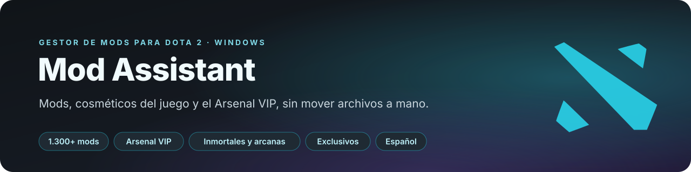
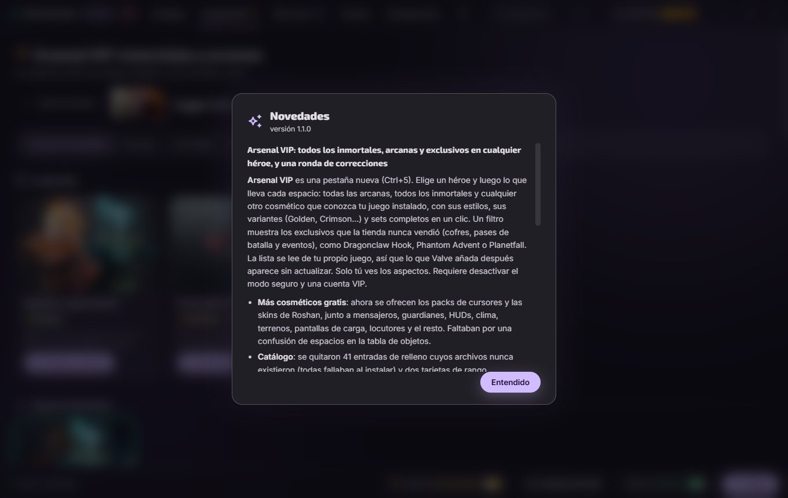

<div align="center">



<p>
  
  <a href="README.en.md"></a>
  <a href="README.ru.md"></a>
</p>

<p>
  <a href="https://github.com/Dreftian/Dota2-Mods-Releases/releases/latest/download/Dota2-Mod-Setup.exe">
    </a>
  
  
</p>

<p>
  <a href="LICENSE"></a>
  <a href="https://dota2-mods.vercel.app"></a>
  
</p>

<p>
  <b>
  <a href="#qué-hace">Qué hace</a> &nbsp;·&nbsp;
  <a href="#arsenal-vip">Arsenal VIP</a> &nbsp;·&nbsp;
  <a href="#instalación">Instalación</a> &nbsp;·&nbsp;
  <a href="#cómo-funciona">Cómo funciona</a> &nbsp;·&nbsp;
  <a href="#novedades-de-la-110">Novedades</a> &nbsp;·&nbsp;
  <a href="#desarrollo">Desarrollo</a> &nbsp;·&nbsp;
  <a href="#licencia-y-créditos">Licencia</a>
  </b>
</p>


</div>

> [!NOTE]
> Mod Assistant no está afiliado con Valve. Todo lo que instala es del lado del cliente: solo lo
> ves tú y no toca la partida de ningún otro jugador. El modo seguro viene activado y mantiene la
> app fuera de los archivos propios de Dota; la única función que los cambia pide permiso antes y
> se revierte byte a byte.

> **¿Por qué no copiar los archivos a mano?** Se puede. Lo que la app añade es todo lo que viene
> después: apagar un mod antes de una partida sin borrarlo, llevar un inmortal o un mensajero que
> tu cuenta no tiene, pasar tu configuración en un solo enlace y que todo siga funcionando después
> de un parche de Dota.

<br>

## Qué hace

<table>
<tr><td width="230"><b>Catálogo completo</b></td><td>Más de 1.300 mods de la comunidad en 41 categorías (héroes, efectos, terrenos, árboles, río, creeps, torres, Roshan, guardianes, mensajeros, HUDs, emblemas, iconos, cursores, fuentes, locutores, música y sonidos), leídos en vivo del repositorio <a href="https://github.com/h6rd/Dota2PornFxWeb">D2PFX</a>: un mod publicado hoy se instala hoy</td></tr>
<tr><td><b>Arsenal VIP</b></td><td>Cualquier inmortal, arcana o cosmético de cualquier héroe, espacio por espacio, con estilos, variantes y sets completos. Incluye los <b>exclusivos que la tienda nunca vendió</b>. <a href="#arsenal-vip">Más abajo</a></td></tr>
<tr><td><b>Cosméticos del juego, gratis</b></td><td>Clima, terreno, HUD, más de 2.000 pantallas de carga, más de 200 mensajeros, guardianes, creeps, torres, música, locutores, mega-kills, rachas de asesinatos, packs de cursores y skins de Roshan. Se leen de la tabla de objetos de tu propio juego, así que lo que Valve añada aparece solo</td></tr>
<tr><td><b>Un clic para entrar y salir</b></td><td>La app descarga el mod, elige un espacio pak libre y limpia al quitarlo. Las categorías que deben cargar primero reciben espacios bajos solas</td></tr>
<tr><td><b>Apagar sin borrar</b></td><td>Desactiva un mod antes de una partida y vuelve a activarlo después. Tu biblioteca queda intacta y la carpeta del juego, limpia</td></tr>
<tr><td><b>Avisa cuando dos mods chocan</b></td><td>Dos mods con el mismo archivo no pueden ganar los dos. La app nombra el archivo, dice de qué mod lo carga el juego y te deja cambiar el orden</td></tr>
<tr><td><b>Rango y nivel de héroe</b></td><td>Personaliza la medalla de tu perfil (incluidas Inmortal y las Top 10/100/1000 con su número) con las estrellas integradas, y las insignias de nivel de héroe</td></tr>
<tr><td><b>Configuraciones por enlace</b></td><td>Guarda lo que usas como preset y envíalo en un mensaje o como archivo <code>.d2mm</code>. Quien lo abre obtiene el mismo aspecto</td></tr>
<tr><td><b>Sobrevive a los parches</b></td><td>La app detecta una actualización de Dota y repone lo que el parche borró, sin escribir nunca mientras el juego está abierto</td></tr>
</table>

<details>
<summary><b>Y además</b></summary>
<br>
<table>
<tr><td width="230"><b>Lista de instalación</b></td><td>Aparta mods mientras navegas e instálalos todos juntos</td></tr>
<tr><td><b>Filtros y búsqueda</b></td><td>Etiquetas de lo que cambia cada mod, el espacio del objeto, la lista de héroes y una búsqueda sobre todo el catálogo y los cosméticos</td></tr>
<tr><td><b>Fuentes y cursores</b></td><td>Se instalan en los archivos del juego con copia de los originales; al quitarlos vuelve todo a como estaba</td></tr>
<tr><td><b>Packs combinados</b></td><td>Une varios mods en un solo espacio pak y sepáralos de nuevo cuando quieras</td></tr>
<tr><td><b>Tus propios archivos</b></td><td>Importa un <code>.vpk</code> o un <code>.zip</code>, o adopta lo que otra herramienta dejó en la carpeta. La app lo identifica contra el catálogo</td></tr>
<tr><td><b>Actualizaciones automáticas</b></td><td>La app instalada busca versiones nuevas en <a href="https://github.com/Dreftian/Dota2-Mods-Releases">Dota2-Mods-Releases</a> y se actualiza sola</td></tr>
<tr><td><b>Sin telemetría</b></td><td>No se recopila ni se envía nada. La cuenta es local, en tu PC</td></tr>
</table>
</details>

<div align="center">
  
  
</div>

<br>

## Arsenal VIP


El Arsenal reescribe los objetos por defecto que toda cuenta tiene, en la tabla de objetos de tu
propio juego, para que se dibujen como el cosmético que elijas. Por eso no hace falta tenerlo en
el inventario, y por eso solo lo ves tú.

- **Todos los héroes, todos los espacios**: arma, cabeza, hombros, espalda, brazos, montura,
  aspecto completo del héroe (las arcanas que cambian el modelo entero), personas, invocaciones,
  habilidades y voz.
- **Todas las rarezas**: por defecto se muestran las arcanas y los inmortales, y un clic muestra
  el resto (legendarios, míticos, raros...).
- **Exclusivos**: un filtro muestra lo que la tienda nunca vendió, de cofres, pases de batalla y
  eventos, como Dragonclaw Hook, Phantom Advent o Planetfall. En la tabla actual del juego eso es
  el 99 % de los inmortales.
- **Estilos y variantes**: cada estilo de una arcana se puede elegir, y las variantes (Golden,
  Crimson, Tyrian...) aparecen agrupadas bajo su versión original.
- **Sets completos** en un clic, a partir de los bundles del propio juego.
- **Personas**: al elegir un objeto de persona, la persona se activa sola.
- Todo es un registro normal de **Mis mods**: se apaga, se quita y viaja en los presets.

Requiere desactivar el modo seguro (la app lo explica y lo hace por ti) y una cuenta VIP.

<br>

## Instalación

1. Descarga el **[instalador de Mod Assistant](https://github.com/Dreftian/Dota2-Mods-Releases/releases/latest/download/Dota2-Mod-Setup.exe)**:
   enlace directo, siempre a la última versión. También hay una
   [versión portable](https://github.com/Dreftian/Dota2-Mods-Releases/releases/latest/download/Dota2.Mod.exe).
2. Ábrelo. La app se instala sin pedir permisos de administrador, crea un acceso directo y arranca.
3. Encuentra Dota 2 sola. Sin opciones de lanzamiento, sin tocar las propiedades de Steam.

> [!IMPORTANT]
> Windows dirá que el editor es desconocido porque el instalador todavía no tiene firma de código
> de pago. Pulsa **Más información** y luego **Ejecutar de todas formas**. Cada versión se publica
> junto con su código fuente completo en
> [Dota2-Mods-Releases](https://github.com/Dreftian/Dota2-Mods-Releases/releases).

Requisitos: Windows 10 u 11 de 64 bits y Dota 2 instalado desde Steam.

<br>

## Cómo funciona

No se inyecta nada en el proceso de Dota y no se abre ningún archivo del juego mientras está en marcha.

- Dota monta **una** carpeta con el nombre de su idioma de **voces**. La app ajusta ese idioma en
  la configuración del propio juego e instala ahí, **sin opciones de lanzamiento**.
- Los mods VPK entran como `pakNN_dir.vpk`, espacios del 10 al 99. Las categorías que deben cargar
  primero reciben del `pak02` al `pak09`. Los espacios 65 a 67 nunca se usan porque los escribe otro programa.
- Apagar un mod renombra su archivo a `.off`: el juego lo salta y el archivo se queda.
- Todo lo que escribe en la carpeta del juego es una transacción: si un paso falla, el cambio
  entero se deshace, incluidos los archivos que se movieron para hacer sitio.
- El modo seguro, activado por defecto, significa que la app no toca los archivos propios de Dota.
  Desactivarlo añade una línea a `gameinfo_branchspecific.gi` y una firma a `dota.signatures`,
  ambos respaldados antes y restaurados byte a byte al volver a activarlo. Es lo que permite los
  cosméticos del juego y el Arsenal.

La imagen completa está en [ARCHITECTURE.md](ARCHITECTURE.md) y cada módulo aparece en
[docs/API.md](docs/API.md), que se genera desde el código.

<br>

## Novedades de la 1.1.0



- **Arsenal VIP**, pestaña nueva (Ctrl+5), con todos los inmortales, arcanas y exclusivos.
- **Más cosméticos gratis**: packs de cursores y skins de Roshan, que antes faltaban.
- **Catálogo**: fuera 41 entradas de relleno que fallaban siempre al instalar y dos tarjetas de
  rango duplicadas; los duplicados exactos se muestran una vez; un mod con el mismo nombre que otro
  de otra categoría ya no se instala en su lugar.
- **Rangos**: los packs de medallas del catálogo vuelven a instalar sus propios archivos, las
  estrellas se integran en la medalla y el personalizador está traducido.
- **Cuentas**: la contraseña de administrador ya no forma parte de la app, se puede cambiar la
  contraseña, Premium vence en su fecha y un archivo de cuentas dañado ya no se borra.
- **Archivos del juego**: reactivar el modo seguro ya no restaura copias `.bak` antiguas que podían
  romper el matchmaking; las reconstrucciones fallidas se avisan y se reintentan; el interruptor de
  mods es una sola transacción.
- **Velocidad**: reconstruir la tabla de objetos con muchos aspectos pasó de unos 30 segundos a menos de uno.
- **Español en todas partes**: unos 340 textos que faltaban.

El historial completo está en [CHANGELOG.es.md](CHANGELOG.es.md) (también en
[inglés](CHANGELOG.md) y [ruso](CHANGELOG.ru.md)).

<br>

## Documentación

| | |
|---|---|
| [ARCHITECTURE.md](ARCHITECTURE.md) · [docs/API.md](docs/API.md) | Qué archivo decide qué, y lo que exporta cada módulo |
| [DECISIONS.md](DECISIONS.md) | Lo decidido a propósito, lo que falta de verdad y el comando que comprueba cada cosa |
| [CONTRIBUTING.md](CONTRIBUTING.md) · [AGENTS.md](AGENTS.md) | Cómo trabajar en el proyecto, con o sin asistente |
| [SECURITY.md](SECURITY.md) · [PRIVACY.md](PRIVACY.md) | Cómo informar una vulnerabilidad, y qué se recopila (nada) |
| [CHANGELOG.es.md](CHANGELOG.es.md) | Qué cambió en cada versión |

<br>

## Informar un problema

Abre un [issue en Dota2-Mods-Releases](https://github.com/Dreftian/Dota2-Mods-Releases/issues)
con tu versión (aparece en Configuración), qué hiciste y qué esperabas.
**Configuración → Diagnóstico → Exportar informe** reúne en un archivo todo lo necesario, sin datos
personales. Para ayuda rápida está el [Discord](https://discord.gg/PBvG8D9MxT) de la comunidad del
catálogo.

Antes, dos cosas: asegúrate de tener la última versión y, si Dota se actualizó hace poco, abre la
app y deja que reponga lo que el parche quitó.

<br>

## Desarrollo

```bash
npm install
npm start                 # la app
npm test                  # toda la suite: node:test, sin frameworks
npm run lint              # eslint, solo lo que no podría ejecutarse
npm run test:coverage     # lo mismo con el mínimo de cobertura
npm run docs              # regenera docs/API.md desde src/
npm run sandbox:seed      # un árbol de juego desechable con mods reales
npm run start:sandbox     # la app contra ese árbol, nunca contra tu juego
```

Node 24, Electron 44 y sin bundler: la interfaz es HTML, CSS y JavaScript simples. Antes de cambiar
algo lee [ARCHITECTURE.md](ARCHITECTURE.md) y [DECISIONS.md](DECISIONS.md).

<!-- facts:deps-es -->
`package.json` lista siete: `adm-zip` y `electron-updater` van dentro de la app; `electron`, `electron-builder`, `eslint`, `fast-check` y `typescript` solo la construyen o la comprueban.
<!-- /facts:deps-es -->
Los tests y todo lo que hay en `tools/` no usan ninguna dependencia. El lector y escritor de VPK,
el parser de KeyValues, las protecciones de zip y la lógica de actualización están escritos aquí,
porque cada dependencia es un extraño con permiso de escritura en la carpeta de un juego.

<br>

## Escrito con Claude Code

Este proyecto se escribe con [Claude Code](https://claude.com/claude-code), y lo dice abiertamente:
los commits llevan un trailer `Co-Authored-By`. La autoría y la responsabilidad de cada cambio
siguen siendo de quien lo firma. [AGENTS.md](AGENTS.md) explica qué pide el proyecto a quien
trabaja con un asistente.

<br>

## Licencia y créditos

**Mod Assistant es una versión modificada de [Dota 2 Mod Manager](https://github.com/TheFleece/dota2-mod-manager)**,
creado por **TheFleece** (Copyright (C) 2026 TheFleece), con espejo en
[GitLab](https://gitlab.com/TheFleece/dota2-mod-manager). Dreftian Devs lo modifica desde el
**20 de septiembre de 2026**; no es el programa original ni lo representa. El aviso de autoría
original está en la app, en **Configuración**, sección "Acerca de".

Se distribuye bajo la [GPL-3.0](LICENSE) con los términos adicionales del archivo [NOTICE](NOTICE):
conservar esa línea de autoría, marcar esta versión como modificada y usar un nombre propio. El
nombre "Dota 2 Mod Manager" y el dominio del proyecto original pertenecen a su autor. Cada versión
publicada incluye su código fuente completo en
[Dota2-Mods-Releases](https://github.com/Dreftian/Dota2-Mods-Releases/releases).

- **Mods, vistas previas, guías y datos del catálogo**: el repositorio de código abierto
  [**D2PFX**](https://github.com/h6rd/Dota2PornFxWeb) de [h6rd](https://github.com/h6rd) y la
  comunidad de modding de Dota 2. Cada tarjeta de la app acredita a su autor.
- Las herramientas de la comunidad (VPKMerge, Background Changer, Compiler, ItemsFix) pertenecen a sus autores.
- Electron, electron-updater y adm-zip (MIT); Source 2 Viewer (MIT), descargado solo cuando hace
  falta; tipografías Inter, Exo 2 y Material Symbols (OFL-1.1, Apache-2.0).

<div align="center">
<sub>Dota 2 es una marca registrada de Valve Corporation. Mod Assistant no está afiliado, respaldado ni patrocinado por Valve. Modificas los archivos del juego bajo tu propio riesgo.</sub>
</div>
