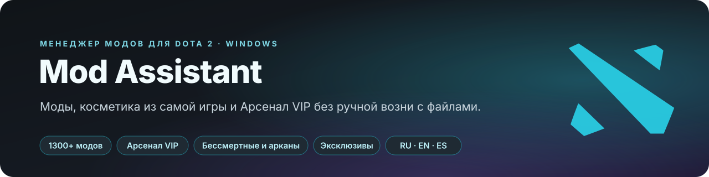
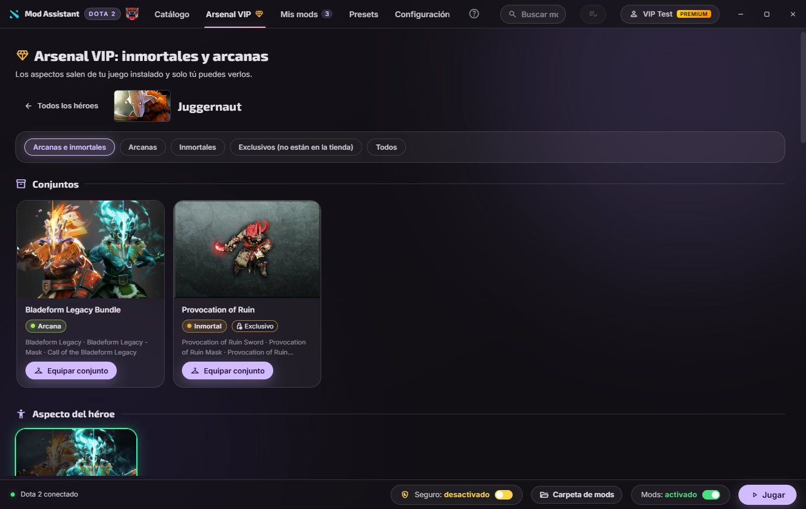
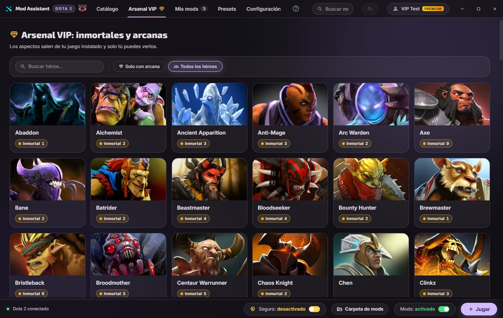

<div align="center">



<p>
  <a href="README.md"></a>
  <a href="README.en.md"></a>
  
</p>

<p>
  <a href="https://github.com/Dreftian/Dota2-Mods-Releases/releases/latest/download/Dota2-Mod-Setup.exe">
    </a>
  
  
</p>

<p>
  <a href="LICENSE"></a>
  <a href="https://dota2-mods.vercel.app"></a>
</p>



</div>

> [!NOTE]
> Mod Assistant не связан с Valve. Всё, что он ставит, работает на стороне клиента: видишь только
> ты, чужие игры он не трогает. Безопасный режим включён по умолчанию и не пускает программу к
> собственным файлам Dota; единственная функция, которая их меняет, спрашивает заранее и
> откатывается байт в байт.

<br>

## Что умеет

<table>
<tr><td width="230"><b>Весь каталог</b></td><td>Больше 1300 модов сообщества в 41 категории, прямо из репозитория <a href="https://github.com/h6rd/Dota2PornFxWeb">D2PFX</a>: мод, опубликованный сегодня, ставится сегодня</td></tr>
<tr><td><b>Арсенал VIP</b></td><td>Любой бессмертный, аркана или косметика любого героя, по слотам, со стилями, вариантами и целыми комплектами, включая <b>эксклюзивы, которых никогда не было в магазине</b></td></tr>
<tr><td><b>Косметика из самой игры, бесплатно</b></td><td>Погода, ландшафт, интерфейс, 2000+ экранов загрузки, 200+ курьеров, варды, крипы, башни, музыка, комментаторы, мега-киллы, серии убийств, наборы курсоров и облики Рошана - из таблицы предметов твоей игры</td></tr>
<tr><td><b>Включить, а не удалить</b></td><td>Выключи мод перед матчем и включи после. Библиотека остаётся, папка игры чистая</td></tr>
<tr><td><b>Конфликты видны</b></td><td>Два мода с одним файлом не могут победить оба. Программа называет файл, говорит, из какого мода его берёт игра, и даёт поменять порядок</td></tr>
<tr><td><b>Ранг и уровень героя</b></td><td>Медаль профиля (включая Титана и Топ 10/100/1000 с номером) со звёздами прямо в медали и значки уровня героя</td></tr>
<tr><td><b>Сборки ссылкой</b></td><td>Сохрани пресет и отправь одним сообщением или файлом <code>.d2mm</code></td></tr>
<tr><td><b>Переживает патчи Dota</b></td><td>Программа замечает обновление игры и возвращает то, что патч стёр, никогда не записывая ничего при запущенной Dota</td></tr>
</table>

<br>

## Арсенал VIP



Арсенал переписывает стандартные предметы, которые есть у каждого аккаунта, в таблице предметов
твоей игры, чтобы они рисовались как выбранная косметика. Поэтому её не нужно иметь в инвентаре, и
поэтому видишь её только ты. Все герои и все слоты, все редкости, фильтр эксклюзивов (сокровищницы,
боевые пропуски, события - это 99 % бессмертных), стили, варианты, целые комплекты и персоны.
Нужны выключенный безопасный режим и VIP.

<br>

## Установка

1. Скачай **[установщик Mod Assistant](https://github.com/Dreftian/Dota2-Mods-Releases/releases/latest/download/Dota2-Mod-Setup.exe)**
   (прямая ссылка, всегда последняя версия) или
   [портативную версию](https://github.com/Dreftian/Dota2-Mods-Releases/releases/latest/download/Dota2.Mod.exe).
2. Запусти. Программа ставится без прав администратора, создаёт ярлык и открывается.
3. Dota 2 она находит сама. Никаких параметров запуска.

> [!IMPORTANT]
> Windows назовёт издателя неизвестным: у установщика пока нет платной подписи кода. Нажми
> **Подробнее**, затем **Выполнить в любом случае**. Каждый релиз публикуется вместе с полным
> исходным кодом в [Dota2-Mods-Releases](https://github.com/Dreftian/Dota2-Mods-Releases/releases).

<br>

## Разработка

```bash
npm install
npm start                 # программа
npm test                  # весь набор тестов на node:test
npm run lint              # eslint
npm run sandbox:seed      # одноразовое дерево игры с настоящими модами
npm run start:sandbox     # программа на нём, никогда не на твоей игре
```

<!-- facts:deps-ru -->
В `package.json` их семь: `adm-zip` и `electron-updater` едут внутри приложения, `electron`, `electron-builder`, `eslint`, `fast-check` и `typescript` только собирают или проверяют его.
<!-- /facts:deps-ru -->

Подробности - в [ARCHITECTURE.md](ARCHITECTURE.md), [DECISIONS.md](DECISIONS.md) и
[CHANGELOG.ru.md](CHANGELOG.ru.md).

<br>

## Написано с Claude Code

Проект пишется с [Claude Code](https://claude.com/claude-code) и не скрывает этого: у коммитов есть
трейлер `Co-Authored-By`. Авторство и ответственность за каждое изменение остаются за тем, кто его
подписывает. [AGENTS.md](AGENTS.md) - что проект просит у работающих с ассистентом.

<br>

## Лицензия и благодарности

**Mod Assistant - изменённая версия [Dota 2 Mod Manager](https://github.com/TheFleece/dota2-mod-manager)**
от **TheFleece** (Copyright (C) 2026 TheFleece), зеркало на
[GitLab](https://gitlab.com/TheFleece/dota2-mod-manager). Dreftian Devs меняет её с **20 сентября
2026 года**; это не оригинальная программа. Уведомление об авторстве оригинала - в программе, в
**Настройках**, раздел «О программе».

Распространяется по [GPL-3.0](LICENSE) с дополнительными условиями из [NOTICE](NOTICE). Название
«Dota 2 Mod Manager» и домен оригинального проекта принадлежат его автору. Моды, превью, гайды и
данные каталога - из репозитория [D2PFX](https://github.com/h6rd/Dota2PornFxWeb) от
[h6rd](https://github.com/h6rd) и сообщества моддеров Dota 2.

<div align="center">
<sub>Dota 2 - товарный знак Valve Corporation. Mod Assistant не связан с Valve и не одобрен ею. Файлы игры ты меняешь на свой страх и риск.</sub>
</div>
